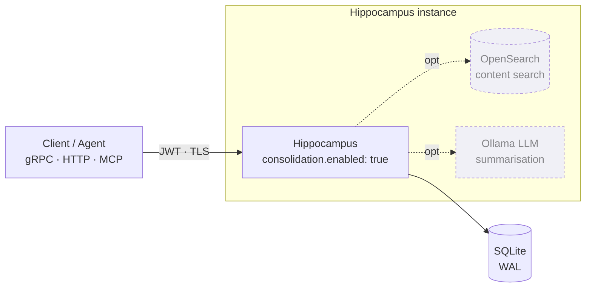
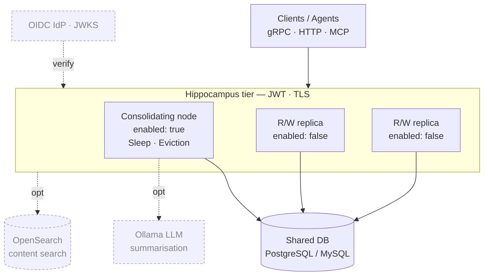

# Hippocampus

> **A finite, biological-inspired memory storage engine for log retention, audit trails, and context management.**

[](https://coveralls.io/github/fastbean-au/hippocampus)

[](https://snyk.io/test/github/fastbean-au/hippocampus)
[](https://pkg.go.dev/github.com/fastbean-au/hippocampus)


---

## 💡 Why Hippocampus?

Traditional storage engines rely on **Time-To-Live (TTL)** or fixed FIFO queues to manage bounded disk space. But age alone is a poor indicator of value: critical system anomalies, high-impact audit events, and frequently referenced context often get purged simply because they crossed an arbitrary time threshold.

Hippocampus applies principles from human memory consolidation to solve long-term data retention under finite capacity. Rather than indiscriminately truncating or expiring data, it continuously evaluates significance, access frequency, and relationships—retaining the **highest-value context** while gracefully degrading low-value noise.

* **Relative Significance & Ranking:** Insert events dynamically relative to adjacent records (`ABOVE`, `BELOW`, or `BETWEEN`) without enforcing rigid, static importance scales.
* **Reinforcement through Recall:** Accessing or querying a record strengthens its retention weight, protecting high-demand operational data from decay.
* **Sleep & Consolidation:** Runs periodic background consolidation cycles to apply decay models, compact space, and distill clusters of episodic details into compact semantic summaries.
* **Durable & Compliance-Safe:** Embedded or centralised deployment backed by SQLite (WAL mode), PostgreSQL, or MySQL. Includes configurable minimum retention floors to guarantee compliance windows regardless of storage pressure.

---

## ⚡ 30-Second Quick Start

Try Hippocampus locally with zero external dependencies (uses pure-Go embedded SQLite):

### 1. Run the Demo Stack
```bash
git clone https://github.com/fastbean-au/hippocampus.git
cd hippocampus
./demo/run.sh
```

### 2. Access the UI & Services
* **Embedded Web Console:** Open [`http://localhost:8080/ui`](http://localhost:8080/ui) to browse, search, and observe memory consolidation in real time — with optional sign-in through your identity provider (Auth0, Keycloak, any OIDC) when `auth.method: idp` is enabled.
* **gRPC Endpoint:** Listening on `localhost:50051`
* **HTTP Gateway:** Listening on `localhost:8080`
* **LGTM stack:** Listening on [`http://localhost:3000`](http://localhost:3000) to view live metrics in Grafana.

---

## 🚀 Docker Setup

Run Hippocampus in containerised environments with pre-configured compose files:

```bash
# Embedded SQLite (Stateless binary, volume-backed DB)
docker compose up --build

# PostgreSQL Backed
docker compose -f docker/docker-compose.postgres.yaml up --build

# Centralised Setup (PostgreSQL + OpenSearch Content Indexing)
docker compose -f docker/docker-compose.corporate.yaml up --build

# Add an MCP-over-HTTP endpoint to the embedded stack (opt-in profile, publishes :8090)
docker compose --profile mcp up --build
```

---

## 🏗️ Deployment Topology & Scaling

Hippocampus scales cleanly using two primary deployment patterns depending on store ownership. Both
support the same optional components — OpenSearch content search, the embedded Ollama summariser, and
JWT/TLS — shown dashed below.

### Embedded / Edge

Run an independent, lightweight instance per subsystem, tenant, or edge node, each owning an embedded
**SQLite** database (WAL mode). One process consolidates its own store — no coordination needed.



### Centralised / Scaled

Point one **consolidating** instance (`consolidation.enabled: true` — the only process that runs
Sleep/eviction) and any number of stateless read/write **replicas** (`consolidation.enabled: false`)
at a shared **PostgreSQL** or **MySQL** database. Replicas scale request throughput horizontally
while a single consolidator owns decay and compaction.



---

## 🤖 MCP Server — Memory for LLMs

Give an AI agent a long-term memory that forgets like a human one. `integrations/mcp` is a
[Model Context Protocol](https://modelcontextprotocol.io) server that exposes Hippocampus to
**Claude Desktop, Claude Code, or any MCP host** — a thin gRPC-client bridge, no extra service to run.

```bash
go build -o hippocampus-mcp ./integrations/mcp
claude mcp add hippocampus -- ./hippocampus-mcp --address localhost:50051
```

* **Curated, safe tools:** store, recall (reinforcing), search, and browse memories and events — destructive/admin RPCs are intentionally withheld, so an agent can't purge or exfiltrate a store.
* **stdio or streamable HTTP** transports; bearer-token auth and TLS mirror the service's own.

*See **[MCP Server guide](docs/mcp.md)** for the tool reference and host configuration.*

---

## 🪵 OpenTelemetry Log Ingestion

Feed real logs into Hippocampus through the standard OpenTelemetry Collector pipeline.
[`integrations/otel/hippocampusexporter`](integrations/otel/hippocampusexporter) is a collector **logs exporter** that turns
each log record into a memory: **severity drives significance**, so the decay cycle forgets routine
`DEBUG`/`INFO` noise first and keeps `ERROR`/`FATAL`. `service.name` becomes the `group`, and records
can be bucketed into events keyed by configurable attributes.

```bash
go install go.opentelemetry.io/collector/cmd/builder@v0.157.0
cd integrations/otel/collector && builder --config builder-config.yaml   # filelog/otlp → batch → hippocampus
./_build/hippocampus-otelcol --config config.yaml
```

*See the **[collector walkthrough](integrations/otel/collector/README.md)** and the
**[exporter configuration](integrations/otel/hippocampusexporter/README.md)**.*

---

## 🔌 Event Sourcing — Broker Bridges

Bridge a message broker into Hippocampus so a stream of events decays and consolidates like any other
memory. [`integrations/eventsource`](integrations/eventsource) ships a bridge for **NATS, MQTT,
RabbitMQ, and Kafka**: each consumes a subject/topic/queue and stores every message as a memory
(payload → body, subject → group, configurable significance).

```bash
cd integrations/eventsource
go run ./cmd/kafka --brokers localhost:9092 --topic events --consumer-group hippocampus
# or, without a Go toolchain, the published image:
docker run --rm ghcr.io/fastbean-au/hippocampus-kafka-bridge:latest \
  --brokers kafka:9092 --topic events --consumer-group hippocampus --address hippocampus:50051
```

* **One reusable core:** a shared `bridge` package with a `Transformer` callback seam — ship the
  default one-message-one-memory mapping, or embed an adapter with your own transform.
* **Broker-native delivery:** manual ack/commit for at-least-once (MQTT/RabbitMQ/Kafka); queue
  groups/consumer groups for horizontal scale.
* **Prebuilt binaries and images:** each release attaches `hippocampus-<broker>-bridge` binaries and
  publishes a multi-arch image per broker to GHCR.

*See the **[Event sourcing guide](docs/eventsource.md)** and the
**[module README](integrations/eventsource/README.md)**.*

---

## 📓 Obsidian — Memory Layer for Your Vault

Use Hippocampus as a bounded, self-consolidating memory layer for an Obsidian vault, so an AI
assistant reads a distilled set of durable facts instead of years of raw daily notes.
[`integrations/obsidian`](integrations/obsidian) is a plugin that stores notes/selections as
memories, searches and recalls them from inside a note, and can auto-sync a folder — talking to the
HTTP gateway, so notes you keep touching are reinforced and survive while trivial ones decay.

*See the **[Obsidian integration guide](docs/obsidian.md)** and the
**[plugin README](integrations/obsidian/README.md)**.*

---

## 📚 Documentation Index

Detailed operational and architectural guides live under [`docs/`](docs/):

| Guide | Description |
| :--- | :--- |
| 🎬 **[Getting Started](docs/getting-started.md)** | Step-by-step build, initial config, and first gRPC/HTTP requests. |
| ⚙️ **[Configurability](docs/configuration.md)** | Exhaustive key reference for TLS, auth, storage drivers, and listeners. |
| 🧠 **[Memory Consolidation](docs/consolidation.md)** | Deep dive on decay algorithms, capacity targets, and summarisation. |
| 🛠️ **[Operations & Deployment](docs/operations.md)** | Sizing storage, PostgreSQL/MySQL tuning, backups, and security hardening. |
| 📊 **[Performance Benchmarks](docs/performance.md)** | Throughput sweeps across SQLite, Postgres, and MySQL under heavy loads. |
| 📐 **[Use Cases & Patterns](docs/use-cases.md)** | Embedded vs. centralised topologies and data transfer strategies. |
| 🧪 **[Demonstrations](docs/demonstrations.md)** | Worked scenarios using real-world data shapes and data generators. |
| 🤖 **[MCP Server](docs/mcp.md)** | Give an LLM host (Claude Desktop/Code) memory tools via the Model Context Protocol. |
| 🔌 **[Event Sourcing](docs/eventsource.md)** | Bridge NATS, MQTT, RabbitMQ, or Kafka into Hippocampus, storing each message as a memory. |
| 📓 **[Obsidian Integration](docs/obsidian.md)** | Use Hippocampus as a memory layer for an Obsidian vault via the plugin or the MCP bridge. |

---

## 🔒 Security & Hardening

Hippocampus is production-hardened out of the box:
* **Built-in Authentication:** JWT bearer tokens with mandatory expiration (`exp`) and zero-downtime rotation via `auth.signingKeys`, or RS256/JWKS verification against any OIDC identity provider (`auth.method: idp`).
* **Single Sign-On (SSO):** OpenID Connect login for the web console — an in-browser PKCE flow, or a server-side [confidential-client flow](docs/configuration.md#server-side-sign-in-authoauth2) (`auth.oauth2`) that keeps the token in an `HttpOnly` session cookie.
* **Role-Based Authorisation:** Per-RPC `reader`/`writer`/`admin` tiers carried in the token, enforced identically on gRPC and the HTTP gateway.
* **Transport Security:** Pinned TLS 1.2+ floor for both internal and external communication.
* **Storage Isolation:** Driver error masking behind standard gRPC status codes to prevent database schema leaks.
* **Client Isolation:** Per-client request attribution, execution query timeouts, and stream concurrency limits.

*Read the [Security Section in Operations](docs/operations.md#security) for details on proxying behind sidecars, token revocation files, and network boundaries.*

---

## ⚠️ Key Limitations

* **Single Consolidator Rule:** Only one instance may perform consolidation/decay tasks per store to prevent race conditions during database compaction.
* **Opaque Payloads:** Memory payloads are stored as raw bytes; by default summaries must be constructed upstream by client applications and submitted via `ReplaceMemoriesWithSummary`. An optional embedded LLM (Ollama, `ollama.enabled`) lets the service author summaries itself — via the `SummariseMemories` RPC or automatically during the sleep cycle — see [Summarisation](docs/consolidation.md#summarisation).
* **Eventually Consistent Search:** The OpenSearch index is secondary and asynchronous. Primary database reads remain strictly consistent, while background sweeps handle reconciliation for content search.

---

## 📄 License

Distributed under the terms specified in the repository. See `LICENSE` for details.
