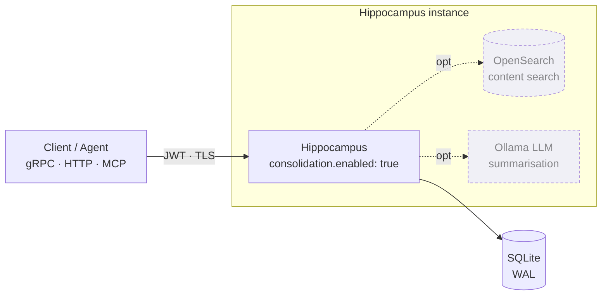
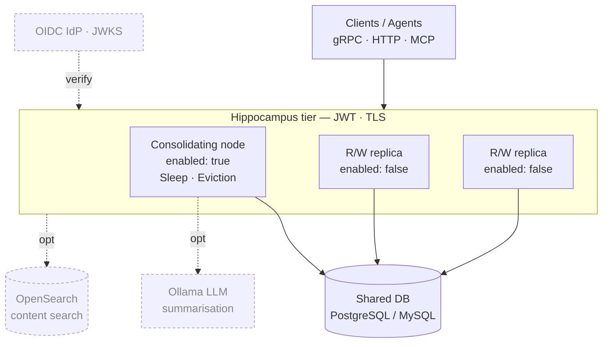

# Hippocampus

> **A finite, biological-inspired memory storage engine for log retention, audit trails, and context management.**

[](https://coveralls.io/github/fastbean-au/hippocampus)

[](https://snyk.io/test/github/fastbean-au/hippocampus)
[](https://pkg.go.dev/github.com/fastbean-au/hippocampus)


**🔭 See it running:** [**hippocampus-demo.com**](https://hippocampus-demo.com) — live consoles on a
compressed decay clock, so memories visibly fade, reinforce, and consolidate while you watch.

---

## 💡 Why Hippocampus?

Traditional storage engines rely on **Time-To-Live (TTL)** or fixed FIFO queues to manage bounded disk space. But age alone is a poor indicator of value: critical system anomalies, high-impact audit events, and frequently referenced context often get purged simply because they crossed an arbitrary time threshold.

Hippocampus applies principles from human memory consolidation to solve long-term data retention under finite capacity. Rather than indiscriminately truncating or expiring data, it continuously evaluates significance, access frequency, and relationships—retaining the **highest-value context** while gracefully degrading low-value noise.

- **Relative Significance & Ranking:** Insert events dynamically relative to adjacent records (`ABOVE`, `BELOW`, or `BETWEEN`) without enforcing rigid, static importance scales.
- **Reinforcement through Recall:** Accessing or querying a record strengthens its retention weight, protecting high-demand operational data from decay.
- **Sleep & Consolidation:** Runs periodic background consolidation cycles to apply decay models, compact space, and distill clusters of episodic details into compact semantic summaries.
- **Content Retrieval, Ranked by Value:** Search memory bodies out of the box on the default embedded install — no cluster to run — with significance and recall count blended into the result order, so the store's own view of what matters shapes what comes back first. Add OpenSearch and an embedding model for semantic and hybrid (meaning + keyword) retrieval. See [Content search](docs/configuration.md#content-search).
- **Durable & Compliance-Safe:** Embedded or centralised deployment backed by SQLite (WAL mode), PostgreSQL, or MySQL. Includes configurable minimum retention floors to guarantee compliance windows regardless of storage pressure.

---

## 🔭 Live Demo — [hippocampus-demo.com](https://hippocampus-demo.com)

Decay, recall reinforcement, and consolidation are slow by design — they play out over days. The
demo instances run the same build with the decay clock compressed, so the whole cycle happens in
minutes and you can watch it. Both consoles take a read-only sign-in: **`demo` / `demo`**.

- **[Book console](https://book.hippocampus-demo.com/ui)** — _Great Expectations_ re-read daily:
  episodic detail distilled into semantic summaries as it ages, and recalled passages holding on.
- **[Logs console](https://logs.hippocampus-demo.com/ui)** — a continuous log stream against a byte
  capacity target: consolidation and eviction working under real storage pressure.
- **[Grafana dashboard](https://grafana.hippocampus-demo.com)** — live telemetry from both stacks.
- **[Config builder](https://config-builder.hippocampus-demo.com)** — build a `config.json` and its
  deployment artefacts in the browser (see [below](#-configuration-wizard)).

---

## ⚡ 30-Second Quick Start

Try Hippocampus locally with zero external dependencies (uses pure-Go embedded SQLite):

### 1. Run the Demo Stack

```bash
git clone https://github.com/fastbean-au/hippocampus.git
cd hippocampus
./demo/run.sh
```

### 2. Access the UI & Services

- **Embedded Web Console:** Open [`http://localhost:8080/ui`](http://localhost:8080/ui) to browse, search, and observe memory consolidation in real time — with optional sign-in through your identity provider (Auth0, Keycloak, any OIDC) when `auth.method: idp` is enabled.
- **gRPC Endpoint:** Listening on `localhost:50051`
- **HTTP Gateway:** Listening on `localhost:8080`
- **LGTM stack:** Listening on [`http://localhost:3000`](http://localhost:3000) to view live metrics in Grafana.

---

## 🚀 Docker Setup

Run Hippocampus in containerised environments with pre-configured compose files:

```bash
# Embedded SQLite (Stateless binary, volume-backed DB)
docker compose up --build

# PostgreSQL Backed
docker compose -f deploy/compose/docker-compose.postgres.yaml up --build

# Centralised Setup (PostgreSQL + OpenSearch Content Indexing)
docker compose -f deploy/compose/docker-compose.corporate.yaml up --build

# Add an MCP-over-HTTP endpoint to the embedded stack (opt-in profile, publishes :8090)
docker compose --profile mcp up --build
```

---

## ☸️ Kubernetes

Kick-start [Kustomize](deploy/k8s/) manifests apply with `kubectl` alone (no Helm), covering both
deployment models below:

```bash
# Embedded SQLite: one StatefulSet + a PersistentVolumeClaim (instance-per-tenant)
kubectl apply -k deploy/k8s/overlays/sqlite

# Centralised PostgreSQL: one consolidator + N read/write replicas over a shared database
kubectl apply -k deploy/k8s/overlays/postgres
```

Each overlay builds on a shared `base/` (namespace, a token-less ServiceAccount, and the Service),
carries `/healthz`/`/readyz` probes and a non-root/read-only-rootfs security posture, and injects
secrets (DB DSN, signing key) as `HIPPOCAMPUS_*` env overrides. See
[`deploy/k8s/README.md`](deploy/k8s/README.md).

---

## 🍺 Homebrew

On macOS or Linux, install from the tap — the quickest path to a running instance or just the
client tools:

```bash
brew install fastbean-au/tap/hippocampus       # the service (+ `brew services start hippocampus`)
brew install fastbean-au/tap/hippocampus-cli   # the `hippo` command-line client
brew install fastbean-au/tap/hippocampus-mcp   # the Model Context Protocol bridge
```

The service formula installs a default embedded-SQLite config (preserved across upgrades) and a
`brew services` definition. See the [tap repo](https://github.com/fastbean-au/homebrew-tap).

---

## 📦 Native (systemd) Install

For a single VM or bare metal with no container runtime — the embedded-SQLite single-instance model
as a hardened systemd service. The release publishes `.deb`/`.rpm` packages that install the binary,
a [hardened unit](deploy/systemd/hippocampus.service) (`DynamicUser`, dropped capabilities,
`ProtectSystem=strict` — the native analogue of the k8s security posture), and a default config:

```bash
sudo dpkg -i hippocampus_<version>_amd64.deb      # Debian/Ubuntu
sudo rpm -i  hippocampus-<version>.x86_64.rpm     # RHEL/Fedora/SUSE

sudoedit /etc/hippocampus/config.json             # review before first start
sudo systemctl enable --now hippocampus
```

The package never auto-enables the service and preserves your config edits across upgrades. See
[`deploy/systemd/README.md`](deploy/systemd/README.md) and
[Operations · Running as a service](docs/operations.md#running-as-a-service).

---

## 🏗️ Deployment Topology & Scaling

Hippocampus scales cleanly using two primary deployment patterns depending on store ownership. Both
support the same optional components — OpenSearch content search, the embedded Ollama summariser, and
JWT/TLS — shown dashed below.

### Embedded / Edge

Run an independent, lightweight instance per subsystem, tenant, or edge node, each owning an embedded
**SQLite** database (WAL mode). One process consolidates its own store — no coordination needed.



### Centralised / Scaled

Point one **consolidating** instance (`consolidation.enabled: true` — the only process that runs
Sleep/eviction) and any number of stateless read/write **replicas** (`consolidation.enabled: false`)
at a shared **PostgreSQL** or **MySQL** database. Replicas scale request throughput horizontally
while a single consolidator owns decay and compaction.



---

## 💻 Command-line client (`hippo`)

Drive a running service from the shell. [`integrations/cli`](integrations/cli) builds `hippo`, a
thin, stateless client exposing the **full** RPC surface as noun-verb subcommands, over **either**
transport — native gRPC (default) or the JSON/HTTP `/v1` gateway (`--transport http`).

```bash
go build -C integrations/cli -o "$PWD/hippo" .
./hippo memory store --body "remember this" --significance 6 --group svc-a
./hippo --transport http --address localhost:8080 -o json memory list --group svc-a | jq
```

- **Operator tool:** memory/event CRUD, recall/search, summarisation, plus admin
  (`whoami`/`sleep`/`purge`) and data movement (`export`/`import`/`transfer`/`clear`). Auth tiers,
  not tool omission, gate what a token may do.
- **Identical across transports:** one client interface backs both, down to the error codes; bearer
  token, TLS, and `HIPPOCAMPUS_*` env overrides mirror the service's own clients.

_See **[CLI guide](docs/cli.md)** for the command reference._

---

## 🧙 Configuration wizard

Not sure where to start with `config.json`? [`cmd/config-wizard`](cmd/config-wizard) builds one for
you — a guided, browser-based builder that also emits the deployment artefacts to carry it (Compose,
Kubernetes, systemd, launchd, or a plain binary runbook), and charts what each forgetting curve will
actually keep before you commit to it.

**Hosted:** <https://config-builder.hippocampus-demo.com> — or run it yourself:

```bash
go run ./cmd/config-wizard                  # http://localhost:8091
docker run --rm -p 8091:8091 ghcr.io/fastbean-au/hippocampus-config-wizard:latest
```

- **Everything client-side:** it is a static page with no server side, so DSNs and signing secrets
  never leave the browser — and secrets are written to a separate `HIPPOCAMPUS_*` environment file
  rather than into `config.json`.
- **Validates as you type:** the service's own startup rules, plus the warnings it would only give
  you after it started.

_See **[Configuration wizard](docs/config-wizard.md)** for the details._

---

## 🤖 MCP Server — Memory for LLMs

Give an AI agent a long-term memory that forgets like a human one. `integrations/mcp` is a
[Model Context Protocol](https://modelcontextprotocol.io) server that exposes Hippocampus to
**Claude Desktop, Claude Code, or any MCP host** — a thin gRPC-client bridge, no extra service to run.

```bash
go build -C integrations/mcp -o "$PWD/hippocampus-mcp" .
claude mcp add hippocampus -- ./hippocampus-mcp --address localhost:50051
```

- **Curated, safe tools:** store, recall (reinforcing), search, and browse memories and events — destructive/admin RPCs are intentionally withheld, so an agent can't purge or exfiltrate a store.
- **stdio or streamable HTTP** transports; bearer-token auth and TLS mirror the service's own.

_See **[MCP Server guide](docs/mcp.md)** for the tool reference and host configuration._

---

## 🪵 OpenTelemetry Log Ingestion

Feed real logs into Hippocampus through the standard OpenTelemetry Collector pipeline.
[`integrations/otel/hippocampusexporter`](integrations/otel/hippocampusexporter) is a collector **logs exporter** that turns
each log record into a memory: **severity drives significance**, so the decay cycle forgets routine
`DEBUG`/`INFO` noise first and keeps `ERROR`/`FATAL`. `service.name` becomes the `group`, and records
can be bucketed into events keyed by configurable attributes.

```bash
go install go.opentelemetry.io/collector/cmd/builder@v0.157.0
cd integrations/otel/collector && builder --config builder-config.yaml   # filelog/otlp → batch → hippocampus
./_build/hippocampus-otelcol --config config.yaml
```

_See the **[collector walkthrough](integrations/otel/collector/README.md)** and the
**[exporter configuration](integrations/otel/hippocampusexporter/README.md)**._

---

## 🔌 Event Sourcing — Broker Bridges

Bridge a message broker into Hippocampus so a stream of events decays and consolidates like any other
memory. [`integrations/eventsource`](integrations/eventsource) ships a bridge for **NATS, MQTT,
RabbitMQ, and Kafka**: each consumes a subject/topic/queue and stores every message as a memory
(payload → body, subject → group, configurable significance).

```bash
cd integrations/eventsource
go run ./cmd/kafka --brokers localhost:9092 --topic events --consumer-group hippocampus
# or, without a Go toolchain, the published image:
docker run --rm ghcr.io/fastbean-au/hippocampus-kafka-bridge:latest \
  --brokers kafka:9092 --topic events --consumer-group hippocampus --address hippocampus:50051
```

- **One reusable core:** a shared `bridge` package with a `Transformer` callback seam — ship the
  default one-message-one-memory mapping, or embed an adapter with your own transform.
- **Broker-native delivery:** manual ack/commit for at-least-once (MQTT/RabbitMQ/Kafka); queue
  groups/consumer groups for horizontal scale.
- **Prebuilt binaries and images:** each release attaches `hippocampus-<broker>-bridge` binaries and
  publishes a multi-arch image per broker to GHCR.

_See the **[Event sourcing guide](docs/eventsource.md)** and the
**[module README](integrations/eventsource/README.md)**._

---

## 📓 Obsidian — Memory Layer for Your Vault

Use Hippocampus as a bounded, self-consolidating memory layer for an Obsidian vault, so an AI
assistant reads a distilled set of durable facts instead of years of raw daily notes.
[`integrations/obsidian`](integrations/obsidian) is a plugin that stores notes/selections as
memories, searches and recalls them from inside a note, and can auto-sync a folder — talking to the
HTTP gateway, so notes you keep touching are reinforced and survive while trivial ones decay.

_See the **[Obsidian integration guide](docs/obsidian.md)** and the
**[plugin README](integrations/obsidian/README.md)**._

---

## 📚 Documentation Index

Detailed operational and architectural guides live under [`docs/`](docs/):

| Guide                                                | Description                                                                                 |
| :--------------------------------------------------- | :------------------------------------------------------------------------------------------ |
| 🎬 **[Getting Started](docs/getting-started.md)**    | Step-by-step build, initial config, and first gRPC/HTTP requests.                           |
| 🧬 **[Clients & Codegen](docs/clients.md)**          | Generate a Python, TypeScript, or any-language client from the proto or OpenAPI document.   |
| ⚙️ **[Configurability](docs/configuration.md)**      | Exhaustive key reference for TLS, auth, storage drivers, and listeners.                     |
| 🧙 **[Configuration wizard](docs/config-wizard.md)** | Build a config and its deployment artefacts in the browser, with a live forgetting preview. |
| 🧠 **[Memory Consolidation](docs/consolidation.md)** | Deep dive on decay algorithms, capacity targets, and summarisation.                         |
| 🛠️ **[Operations & Deployment](docs/operations.md)** | Sizing storage, PostgreSQL/MySQL tuning, backups, and security hardening.                   |
| 📊 **[Performance Benchmarks](docs/performance.md)** | Throughput sweeps across SQLite, Postgres, and MySQL under heavy loads.                     |
| 📐 **[Use Cases & Patterns](docs/use-cases.md)**     | Embedded vs. centralised topologies and data transfer strategies.                           |
| 🧪 **[Demonstrations](docs/demonstrations.md)**      | Worked scenarios using real-world data shapes and data generators.                          |
| 🤖 **[MCP Server](docs/mcp.md)**                     | Give an LLM host (Claude Desktop/Code) memory tools via the Model Context Protocol.         |
| 🔌 **[Event Sourcing](docs/eventsource.md)**         | Bridge NATS, MQTT, RabbitMQ, or Kafka into Hippocampus, storing each message as a memory.   |
| 📓 **[Obsidian Integration](docs/obsidian.md)**      | Use Hippocampus as a memory layer for an Obsidian vault via the plugin or the MCP bridge.   |

What changed between releases — and what a version number does and does not promise — is in
**[CHANGELOG.md](CHANGELOG.md)**. Hippocampus is pre-1.0, so read the **Breaking** section of any
release you skip over.

---

## 🔒 Security & Hardening

Hippocampus is production-hardened out of the box:

- **Built-in Authentication:** JWT bearer tokens with mandatory expiration (`exp`) and zero-downtime rotation via `auth.signingKeys`, or RS256/JWKS verification against any OIDC identity provider (`auth.method: idp`).
- **Single Sign-On (SSO):** OpenID Connect login for the web console — an in-browser PKCE flow, or a server-side [confidential-client flow](docs/configuration.md#server-side-sign-in-authoauth2) (`auth.oauth2`) that keeps the token in an `HttpOnly` session cookie.
- **Role-Based Authorisation:** Per-RPC `reader`/`writer`/`admin` tiers carried in the token, enforced identically on gRPC and the HTTP gateway.
- **Transport Security:** Pinned TLS 1.2+ floor for both internal and external communication.
- **Storage Isolation:** Driver error masking behind standard gRPC status codes to prevent database schema leaks.
- **Client Isolation:** Per-client request attribution, execution query timeouts, and stream concurrency limits.

_Read the [Security Section in Operations](docs/operations.md#security) for details on proxying behind sidecars, token revocation files, and network boundaries._

---

## ⚠️ Key Limitations

- **Single Consolidator Rule:** Only one instance may perform consolidation/decay tasks per store to prevent race conditions during database compaction. Enforced at startup on every driver: `postgres`/`mysql` take a session-scoped advisory lock, and `sqlite` an exclusive OS lock on a `hippocampus.lock` file in `storage.directory` — see [Deployment model](docs/operations.md#deployment-model-one-consolidating-instance-per-store).
- **Opaque Payloads:** Memory payloads are stored as raw bytes; by default summaries must be constructed upstream by client applications and submitted via `ReplaceMemoriesWithSummary`. An optional embedded LLM (Ollama, `ollama.enabled`) lets the service author summaries itself — via the `SummariseMemories` RPC or automatically during the sleep cycle — see [Summarisation](docs/consolidation.md#summarisation).
- **Eventually Consistent Search (OpenSearch only):** The OpenSearch index is secondary and asynchronous. Primary database reads remain strictly consistent, while background sweeps handle reconciliation for content search. The built-in SQLite content search used when OpenSearch is disabled is maintained inside the write itself, so it is not subject to this; `postgres`/`mysql` have no content search without OpenSearch. See [Content search](docs/configuration.md#content-search).

---

## 📄 License

Distributed under the terms specified in the repository. See `LICENSE` for details.
