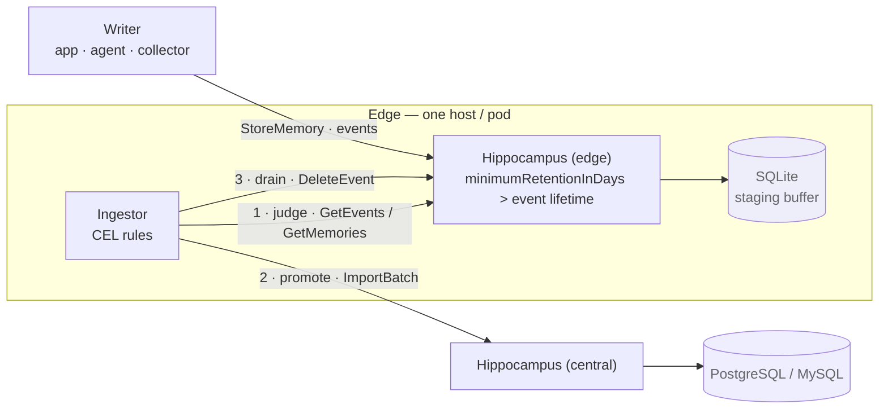
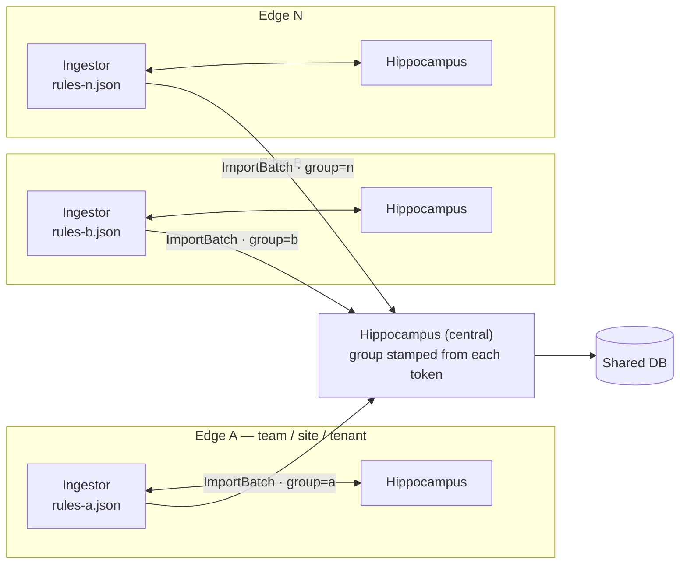
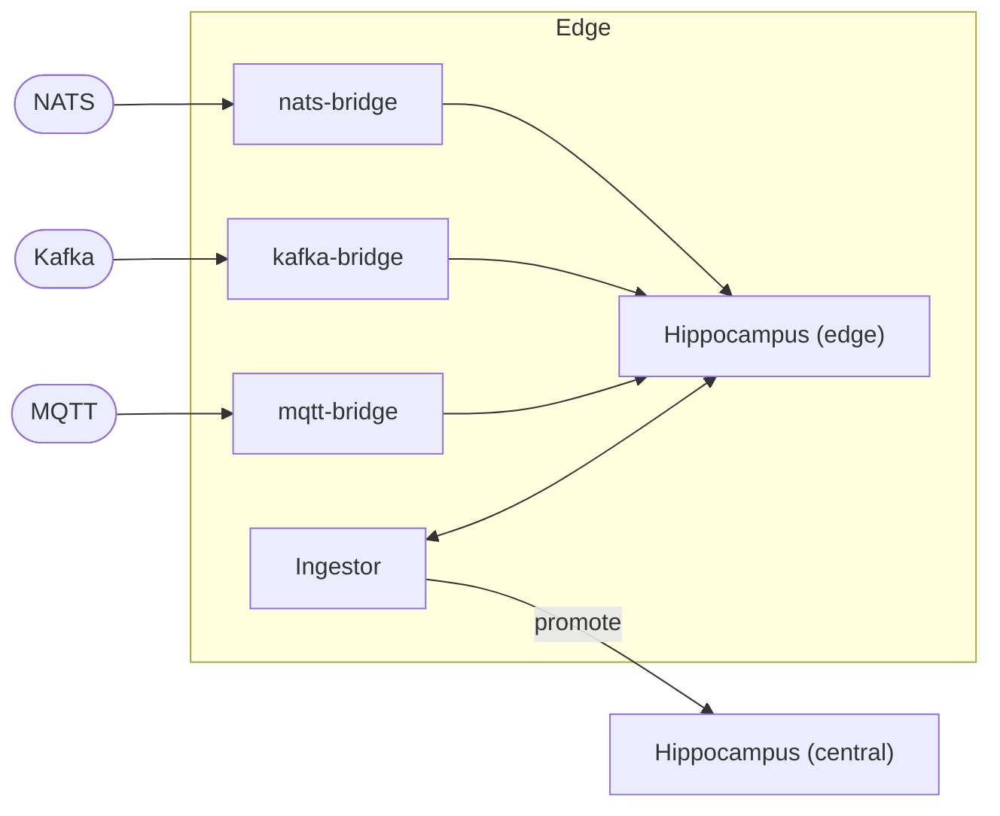

# Ingestor

The **ingestor** turns a Hippocampus instance into a staging buffer with an admission gate in front
of a central store. Data is written to an edge instance against an event; when that event completes,
a rules engine judges it and the event is either **promoted** whole to the central instance,
**promoted after being reduced**, or **dropped**.

It ships as `integrations/ingestor` — a separate Go module and a separate process
(`hippocampus-ingestor`), not a feature of the service. The edge is a stock, unmodified
`hippocampus` binary.

- [Deployment shapes](#deployment-shapes)
- [Why a separate process](#why-a-separate-process)
- [How it works](#how-it-works)
- [Observability](#observability)
- [Configuring the edge](#configuring-the-edge) ← **read this one**
- [Rules](#rules)
- [Reductions](#reductions)
- [Applying rule changes to a running instance](#applying-rule-changes-to-a-running-instance)
- [Memories with no event](#memories-with-no-event)
- [Flags](#flags)
- [Limitations](#limitations)

## Deployment shapes

### One ingestor

The minimum: a writer fills an edge instance, and one ingestor promotes what earns it into the
central store. Three processes, two stores, and the edge holds only what has not been judged yet.



The numbered order is the whole safety argument: **promote before drain**, so a failure anywhere
leaves the records where they still exist.

### A fleet of ingestors

Scaling is by fan-out, not by making one edge bigger. Each edge is independent — its own store, its
own rules file, its own token — and the central instance stamps each one's `group` from its token,
so the partition needs no cooperation between them.



Each ingestor sets `--metrics-group` to the same label its token carries, so one dashboard slices
promotion rate, drop rate and staleness per tenant.

### Ingestors and event sourcing

The two integrations compose: a [broker bridge](eventsource.md) is a *writer* into the edge, and the
ingestor is what decides which of that traffic is worth keeping centrally. The bridge answers "get it
into Hippocampus"; the ingestor answers "was it worth it".



One thing to get right in this shape: the bridges write memories, and **a memory with no event is
never judged**. Either give the bridge an event to write against, or set `--orphans` deliberately —
see [Memories with no event](#memories-with-no-event). The `hippocampus.ingestor.orphans` gauge is
what tells you which of those you have.

## Why a separate process

Two reasons, and the second is the practical one.

**The service is deliberately content-blind.** Only the [`summarise`](../summarise) package sees
memory bodies. A rules engine that matches on content and hard-drops whole events is the *opposite*
of the decay model the service implements — deterministic where decay is probabilistic, a gate where
decay is a gradient. Putting it inside `hippocampus/` would place a second, contradictory retention
policy inside the component whose whole thesis is the first one.

**Everything it needs is already on the RPC surface.** The ingestor is a client:

| Step | RPC |
| --- | --- |
| Find judgeable events | `GetEvents` with `time_end_min` |
| Read one event's memories | `GetMemories` with `event_id` (paged) |
| Promote | `ImportBatch` — full-state upsert by id, **idempotent** |
| Condense first | `SummariseMemories` on the edge |
| Drain | `DeleteEvent` with `memories: true` |

That idempotency is what makes the whole design cheap: promote-then-drain is at-least-once against a
receiver where a repeat is a no-op, so a crash between the two re-promotes identical rows on the next
pass. **The ingestor therefore holds no cursor, no bookmark and no state at all** — the edge store
*is* the queue, and what it contains is exactly what has not been judged yet.

It also composes with [group scoping](configuration.md#group-scoping) unchanged: an import never
trusts the group on the wire, it stamps from the verified claim. One group per edge token, no group
in the payload, and the central store partitions itself.

## How it works

One **pass** runs every `--interval-seconds`:

1. List events that have ended at least `--settle-seconds` ago.
2. For each, page its memories and evaluate the ruleset against the resulting facts.
3. Act: promote (with any reduction), or drop.
4. Drain the event and its memories from the edge.

The pass re-reads the *first* page each time rather than paging with an offset, because a drained
event shifts every later event back into the window an offset would have skipped. It stops when a
page brings nothing new.

**The drain is guarded.** Before deleting, the event's memory count is re-read; if it changed since
the judgement, the whole event is left for the next pass and re-judged whole. That is what makes a
memory landing against an already-ended event safe — `--settle-seconds` makes it rare, and the
re-check makes it correct.

### Does the edge have to be embedded?

No. The ingestor only speaks RPCs, so the edge can be embedded SQLite (one process, one volume, no
dependencies — the usual choice) or a `postgres` edge with replicas, with no change here.

**Scaling is by fan-out, not by scaling one edge.** Events are judged independently, so N edges each
with their own ingestor — one per host, per broker partition, per tenant — is the scaling story, and
it is the same fan-out that makes each edge single-tenant in the first place.

## Configuring the edge

> **An edge running default configuration will forget in-flight events.** The staging buffer must not
> decay, or consolidation and eviction will delete the memories of an event *before the rules ever
> see it* — silently, and in a way no test of the ingestor would catch.

Set a retention floor above the longest an event can stay open:

```json
"consolidation": {
    "minimumRetentionInDays": 7
}
```

`minimumRetentionInDays` is the **hard** floor: both value-based consolidation and capacity eviction
short-circuit on it, unlike `minimumAgeInDays`, which only defers consolidation and which eviction
ignores entirely. See [Consolidation](consolidation.md).

Optionally disable the timed cycle altogether — a supported mode, not a workaround:

```json
"sleep": { "periodSeconds": 0 }
```

Then **watch the retention gauges**. `hippocampus.memories.retained` and
`hippocampus.retained_bytes` against `hippocampus.capacity_bytes` exist to expose exactly the edge's
characteristic failure: promotion stalls, retention holds everything, and eviction can never bring
the store back under its target. They are published when `minimumRetentionInDays` and
`capacityBytes` are both set — which on an edge they should be. See
[Operations](operations.md#metrics).

## Observability

### Health endpoints

The ingestor serves `/healthz` and `/readyz` on `--health-port` (**8090 by default**; 0 disables).
Running several client daemons on one host means giving each its own port.

| Endpoint | Answers | Fails when |
| --- | --- | --- |
| `/healthz` | is this process alive | never, while the process runs |
| `/readyz` | can it do its job right now | either instance is unreachable or not serving |

The split is load-bearing. A brief outage of either Hippocampus instance must **not** fail liveness,
or an orchestrator will kill-loop a perfectly healthy ingestor every time the far end restarts.
`/readyz` names the end that is down, so a failing probe is a diagnosis rather than a puzzle:

```json
{"component":"hippocampus-ingestor","dependencies":{"source":"ok","target":"unreachable"},"status":"not ready"}
```

The checks call the standard gRPC health service, which needs no token and which the service drives
from its own database readiness — so "ready" means the far end can actually serve, not merely that a
socket opened.

### Metrics

`--metrics` exports over OTLP/gRPC to `--otlp-endpoint`, exactly as the service does.

| Metric | Type | Attributes |
| --- | --- | --- |
| `hippocampus.ingestor.events` | counter | `outcome` (promoted/dropped/skipped/failed), `rule` |
| `hippocampus.ingestor.memories` | counter | `kind` (event/orphan) |
| `hippocampus.ingestor.orphans` | gauge | — |
| `hippocampus.ingestor.orphans.handled` | counter | `outcome` |
| `hippocampus.ingestor.rule_errors` | counter | `rule` |
| `hippocampus.ingestor.passes` | counter | `outcome` (ok/failed) |
| `hippocampus.ingestor.pass.duration` | histogram (s) | `outcome` |
| `hippocampus.ingestor.seconds_since_last_pass` | gauge | — |
| `hippocampus.client.rpc.requests` | counter | `endpoint` (source/target), `rpc`, `code`, `outcome` |
| `hippocampus.client.rpc.duration` | histogram (s) | as above |

Three of these carry the design:

- **`outcome` on the event counter is four-valued, not a success bool.** An event a rule *dropped* is
  the admission gate working — a rules file that discards most of what it sees would otherwise be
  indistinguishable from an ingestor that cannot promote anything. `skipped` and `failed` are the two
  worth alerting on.
- **`seconds_since_last_pass` is the one that alerts on silence.** Everything else is a counter, and a
  counter that stops advancing looks exactly like an ingestor with nothing to do. It is reset only by
  a *successful* pass.
- **`rule_errors` is per rule.** A rule that errors on every event never matches, and so silently
  changes what is promoted; a bare error total could not tell you which rule.

### Tenancy

`--metrics-group` stamps a tenancy label on everything this process emits, as **both** a resource
attribute and an attribute on each metric. The duplication is deliberate: the OTLP-to-Prometheus
translation puts resource attributes in `target_info`, so without it every query and alert would
need `... * on(job) group_left(hippocampus_group) target_info`.

It is a **per-process** value, never read off the records. That is what keeps it safe: the label is
fixed for the process's lifetime, so it multiplies the series count by exactly one, whereas a group
taken from each event would be unbounded. In the fleet model each edge is one tenant anyway, so the
two coincide.

```promql
sum by (hippocampus_group, outcome) (rate(hippocampus_ingestor_events_total[5m]))
```

## Rules

A rules file is JSON; each rule's match clause is a CEL expression.

```json
{
  "defaultAction": "drop",
  "rules": [
    { "name": "keep-errors",
      "expr": "event.metadata[?'severity'].orValue('') == 'error'",
      "action": "promote" },

    { "name": "sample-chatter",
      "expr": "event.group == 'chatter' && event.memory_count >= 50",
      "action": "promote",
      "reduce": { "keepTopN": 10 } }
  ]
}
```

Rules are tried in file order and **the first match wins**. `defaultAction` is **required**: a file
that omitted it would silently drop every unmatched event, which is the worst failure this component
has.

Check a file before deploying it — this compiles every expression and connects to nothing:

```bash
hippocampus-ingestor --rules rules.json --check-rules
```

### What an expression can see

`event`:

| Field | Type | |
| --- | --- | --- |
| `id`, `name`, `description`, `group` | string | |
| `significance` | int | |
| `metadata` | map(string, string) | |
| `time_start`, `time_end` | int | UnixNano |
| `duration_seconds` | double | derived |
| `memory_count`, `body_bytes` | int | over the event's memories |
| `significance_min`, `significance_max` | int | over the event's memories |
| `significance_mean` | double | over the event's memories |

`memories` — a list of `{id, body, significance, is_binary, is_summary, recall_count, time_stamp,
metadata}`.

The aggregates are on `event` deliberately, so the common shape rules need no comprehension — and so
the ingestor can skip building the memory list entirely when no rule reads it.

### The mistake every rules file makes first

Indexing a metadata key that is absent is an **evaluation error** in CEL, not an empty string:

```javascript
event.metadata['severity'] == 'error'   // errors on any event without that label
```

A rule that errors **does not match**, the error is logged naming the rule, and the remaining rules
are still tried — an admission gate must not let a broken rule quietly change what is promoted. But
write the guarded form:

```javascript
event.metadata[?'severity'].orValue('') == 'error'      // optional access
'severity' in event.metadata && event.metadata['severity'] == 'error'
```

### Bounds

Each evaluation is bounded by a CEL cost budget (`--rule-cost-limit`) and a wall-clock timeout
(`--rule-timeout-seconds`), because a rules file is operator input that runs against every completed
event. Tripping either is an evaluation error, handled as above.

## Reductions

A `promote` rule may carry a `reduce` block:

| Field | Effect |
| --- | --- |
| `keepTopN` | promote only the N most significant memories |
| `minSignificance` | promote only memories at or above this significance |
| `summarise` | replace the event's memories with one generated summary, then promote that |

`keepTopN` and `minSignificance` compose and are content-blind: they choose what crosses to the
central store. **The memories not promoted are still drained** — a reduction says what is kept
centrally, not what survives on the edge.

`summarise` is different in kind. It calls `SummariseMemories` on the **edge**, which generates the
summary and replaces the originals there, so it needs [`ollama.enabled`](configuration.md#ollama) on
that instance. An edge without it reports `FailedPrecondition` and the event **fails loudly** rather
than being promoted whole — quietly promoting everything a rule asked to have condensed would be the
opposite of what was written. It cannot be combined with the other two: there is nothing left for a
selection to select from.

## Applying rule changes to a running instance

The rules file is re-stat'ed every `--rules-refresh-seconds` and re-read when its mtime changes. A
**bad initial load fails startup**; a **bad reload is logged and discarded**, leaving the last good
ruleset serving. (Same contract as the [revocation file](configuration.md#revocation), and the same
implementation shape.)

Because judgement happens **once, at completion** — not at ingest — in-flight events need no special
handling:

| State when the rules reload | Outcome |
| --- | --- |
| Event still open | Judged by the **new** rules when it completes |
| Completed, not yet judged | Judged by the new rules on the next pass |
| Mid-judgement | Judged by the ruleset it started with — one event, one consistent ruleset |
| Already promoted or dropped | Final; a rule change cannot recall records from the central store |

The third row is the only mechanism required: each pass takes one immutable snapshot of the ruleset.

## Memories with no event

Rules key on events, so a memory carrying no `event_id` is never judged. `--orphans` says what
happens to those older than `--orphan-age`:

| Value | Effect |
| --- | --- |
| `ignore` (default) | left alone; the edge's own decay eventually reaps them |
| `promote` | promoted, then removed from the edge |
| `drop` | removed from the edge without being promoted |

**Every policy reports the count**, including `ignore` — a rising number here almost always means the
writers are not associating memories with events, which is the actual bug.

## Flags

Every flag is also settable as `HIPPOCAMPUS_INGESTOR_<FLAG>` with dashes as underscores, so tokens
need not appear in argv.

| Flag | Default | |
| --- | --- | --- |
| `--source-address` | `localhost:50051` | the edge |
| `--target-address` | — | the central instance (required) |
| `--source-token`, `--target-token` | — | bearer tokens, one per endpoint |
| `--source-tls*`, `--target-tls*` | off | the usual trust options, per endpoint |
| `--rules`, `-r` | — | rules file (required) |
| `--rules-refresh-seconds` | 30 | how often it is re-stat'ed |
| `--interval-seconds` | 30 | how often a pass runs |
| `--settle-seconds` | 60 | how long an event must have been ended before it is judged |
| `--page-size` | 100 | page size for both reads |
| `--max-event-memories` | 10000 | an event holding more is left **unjudged** |
| `--rule-cost-limit` | 1000000 | CEL cost budget per evaluation |
| `--rule-timeout-seconds` | 2 | wall-clock bound per evaluation |
| `--orphans`, `--orphan-age` | `ignore`, 1h | see above |
| `--dry-run` | off | judge and report; move and delete nothing |
| `--check-rules` | off | compile the rules, print a summary, exit |
| `--health-port` | 8090 | `/healthz` and `/readyz` (0 disables) |
| `--health-bind-address` | all | interface for the probe listener |
| `--metrics`, `--tracing` | off | OTLP/gRPC export |
| `--otlp-endpoint` | SDK default | collector endpoint |
| `--metrics-group` | — | tenancy label (see [Tenancy](#tenancy)) |

The two endpoints are configured **entirely separately** — separate addresses, tokens and TLS blocks
— because they are different trust domains. The target's token is what stamps the group on everything
promoted.

## Limitations

- **A dropped event is unrecoverable.** This is a hard gate, unlike decay.
- **Cross-event memory links do not survive the crossing.** `ImportBatch` applies links after the
  rows exist and drops any whose far end is not present, so a link from a promoted event to a dropped
  (or not-yet-promoted) one is lost. The count is logged by the receiving service.
- **The ingestor reads memory bodies.** CEL rules can match on content, so — like `summarise/` — this
  is a component with visibility into what the service itself never looks at. Bear that in mind when
  deciding where it runs.
- **An event over `--max-event-memories` is left unjudged**, reported, and never promoted or dropped.
  Judging a truncated view of an event would decide its fate on facts that are not its own.
