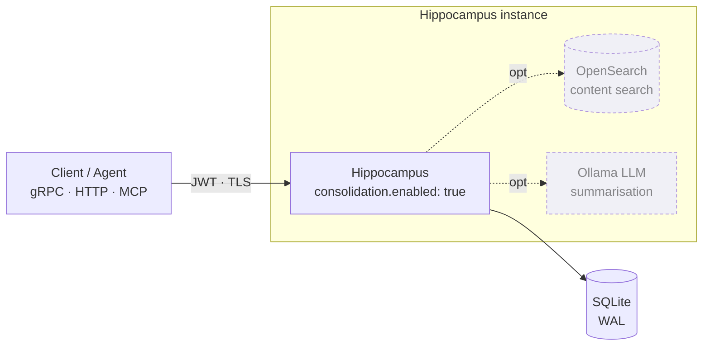
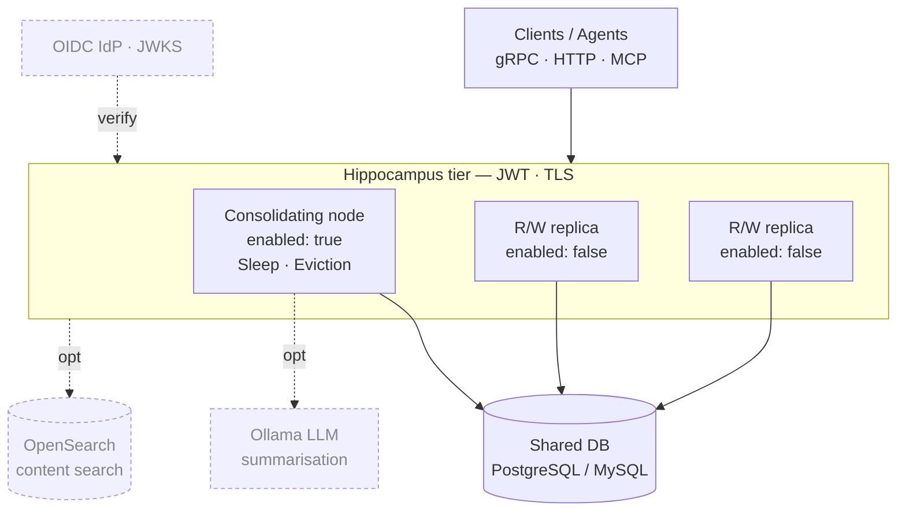
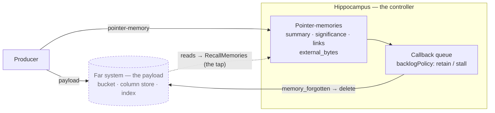
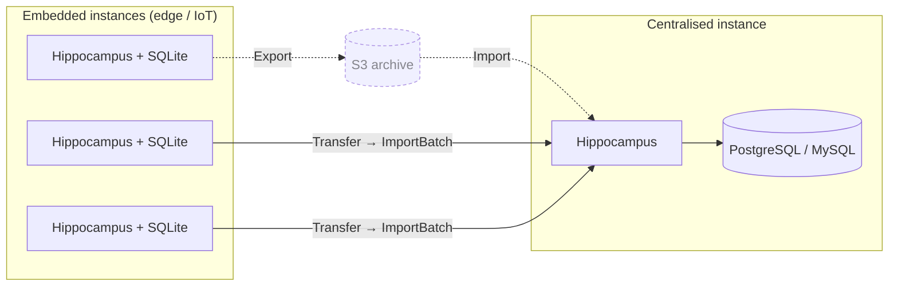

# Use cases & deployment modes

## When Hippocampus fits

Hippocampus is for **long-term retention under a finite budget**, where you want to keep the most
significant information indefinitely but cannot (or do not want to) keep everything, and where a
fixed TTL is too blunt an instrument. Instead of "delete after N days", it keeps what matters based
on significance, age, how often something is recalled, and how it relates to other records — and
forgets the rest, most-worthless-first, to stay within a capacity bound. When a _minimum_ guarantee
is also needed — keep everything for at least N days no matter what — an optional
[retention floor](consolidation.md#minimum-retention) provides it, overriding capacity so recent
data is never reaped early.

It suits data that has a long tail of value: most of it becomes irrelevant quickly, a fraction stays
important for a long time, and which is which is not known up front. Some shapes that fit:

- **Operational / audit event history** — keep every deploy, incident, and config change while they
  matter; let routine, low-significance chatter decay; reinforce (recall) the records an
  investigation touches so they survive. `group` labels scope events to a system or team, and
  [group scoping](configuration.md#group-scoping) can bind a token to them so each team reaches only
  its own. Where a compliance window applies, a retention floor guarantees nothing is dropped before
  it elapses.
- **Agent / assistant memory** — a bounded long-term memory for an LLM agent: store observations as
  memories, group them into events, recall the relevant ones on each interaction (which reinforces
  them), and let the unused ones fade. Summarisation condenses a pile of related-but-quiet memories
  into a single "gist" memory rather than dropping the detail outright.
- **Per-device / edge telemetry** — retain a device's own significant history locally within a fixed
  storage budget, and periodically transfer it to a central store.
- **Personal knowledge management (Obsidian / Logseq)** — a memory layer for a note vault, so an AI
  assistant reads a distilled set of durable facts instead of years of raw daily notes: notes that
  get recalled are reinforced and survive, trivial ones decay. See the
  [Obsidian integration](obsidian.md).
- **Deciding what _another_ system keeps** — the payload stays in the bucket, column store or index
  that already holds it, and one pointer-memory per record carries its significance, its links and
  its size. This store runs the decay and says what should go; the far system does the deleting. See
  [Retention controller](#retention-controller-the-payload-stays-where-it-is) below.

It is **not** a general-purpose database, a cache, or a system of record for data you must never
lose: forgetting is the point, and the service has no visibility into memory _content_ (bodies are
opaque blobs — the caller supplies any summary text).

## Worth knowing before you start

Five properties that shape what you can build on it. None of them is a limitation to work around;
each is a consequence of what the store is for, and each has a place to read further.

- **Forgetting is the point.** This is not a system of record for data you must never lose. Where a
  guarantee is needed, a [retention floor](consolidation.md#minimum-retention) overrides even
  capacity pressure — so "keep everything for at least N days" is expressible, and is honoured
  ahead of the capacity target rather than beneath it.
- **One consolidator per store.** Only one instance may run decay against a given store, enforced at
  startup on every driver — a file lock on SQLite, an advisory lock on the server drivers. Replicas
  scale reads and writes around it. See the
  [deployment model](operations.md#deployment-model-one-consolidating-instance-per-store).
- **Payloads are opaque.** The service does not read memory bodies, which is why the consolidation
  scans never touch them and why summaries come from the client — unless you enable the optional
  embedded LLM ([Ollama](consolidation.md#embedded-llm-ollama)), the one component that does read
  content.
- **Content search is a secondary index.** Primary reads are strictly consistent. The optional
  OpenSearch index is asynchronous and best-effort, though hits are always re-read from the primary
  store so stale entries drop out; the store's own index, available on every driver, is maintained
  inside the write itself and is not subject to that. Only one backend is ever selected, so the
  store's own index is on by default and derived off when OpenSearch is configured — and it can be
  turned off outright, since it is the largest non-body cost the store carries. See
  [Content search](configuration.md#content-search) and
  [Turning the store index off](configuration.md#turning-the-store-index-off).
- **A shared store is a shared trust domain.** Group scoping is a _soft_ partition: records are
  scoped, but the decay dynamics stay store-global, so a busy group influences what a quiet one
  forgets. Hard isolation is one instance per tenant — read
  [the trust boundary](security.md#group-scoping-and-the-trust-boundary) before relying on either.

## Deployment modes

### Embedded / edge / IoT (SQLite)

A single statically-linked binary plus one SQLite file, no external dependencies. Runs on-device or
alongside an application. Immediate durability (WAL), app-driven compaction, and both the byte
capacity target and the WAL-triggered checkpoint are available to bound on-disk size under bursty
writes. This is the default (`storage.driver: sqlite`).

Ideal where each producer keeps its _own_ bounded memory — one instance per device or per process.

### Centralised / corporate (Postgres or MySQL, optional OpenSearch)

A server-backed deployment: `storage.driver: postgres` or `mysql`, typically behind TLS with
authentication, exposing both gRPC and the HTTP/JSON gateway for clients that would rather not speak
gRPC. Add the optional OpenSearch secondary index (`opensearch.enabled`) for content search over
memory bodies (`SearchMemories`) — the primary store stays authoritative and the index is
best-effort and rebuildable. See the [Operations guide](operations.md) for driver selection and
sizing (notably the MySQL InnoDB buffer-pool note).

One instance runs consolidation (`consolidation.enabled: true`, the single owner of Sleep and
eviction); any number of stateless read/write replicas (`consolidation.enabled: false`) share the
same database to scale request throughput horizontally.

Provided compose stacks: `deploy/compose/docker-compose.postgres.yaml`, `deploy/compose/docker-compose.mysql.yaml`, and
`deploy/compose/docker-compose.opensearch.yaml`.

### Instance per tenant / subsystem

Because decay, capacity pressure, and eviction are **global** dynamics over a store, tenancy is _not_
built into the service — one noisy tenant sharing a store would make everyone else forget faster.
Instead, run **one instance per tenant** (or per subsystem, per environment). Containerisation makes
one container + one SQLite volume (or one Postgres database) per tenant trivial, and it gives perfect
isolation of the memory dynamics, per-tenant capacity/decay tuning, and clean per-tenant deletion
(drop the volume). This is also horizontal scaling by sharding, without leader election.

### Retention controller: the payload stays where it is

The inversion of every mode above. Instead of writing the data here, leave it in the bucket, column
store or index that already holds it and write **one pointer-memory per record** — a summary or key
in the body, the record's own significance, its links to related records, and
[`external_bytes`](configuration.md#external-bytes): the size of the payload out there. Decay runs
here; deletion happens there, driven by a callback. Hippocampus stops being a store for that data and
becomes a _retention controller_ over it.

The reason to reach for it is narrower than it first looks, and worth stating exactly, because most
of the obvious pitch is already free. ClickHouse's TTL takes an arbitrary expression and S3 lifecycle
rules do the same for objects, so `if(has_error, 30, 3) DAY` covers per-record significance tiers
with no daemon at all. What neither can do is **close the loop**: a TTL names an _age_ and hopes the
resulting volume fits, and a traffic spike does not shorten it by one second.
[The capacity target](consolidation.md#capacity-target) names a _budget_ and moves the threshold to
hold it. That is a different control model rather than a better-tuned version of the same one, and
where disk is the binding constraint and traffic is spiky it is the correct one. Recall
reinforcement and link propagation are on top of it.

**What it needs configured.** The external axis
(`consolidation.capacityExternalBytes` and its floor) so pressure measures the bytes that actually
matter — a pointer-memory is a couple of hundred bytes against a payload of tens of kilobytes, so
`capacityBytes` alone would regulate a quantity with no relationship to the resource it exists to
protect. Then [outbound callbacks](configuration.md#outbound-callbacks) pointed at the far system,
with **`callbacks.backlogPolicy` set to `retain` or `stall`**: here a `memory_forgotten` delivery is
an _instruction_, and the default `abandon` discards deletions at the queue's caps, orphaning the
payload behind each one permanently. Keep the [forgotten
log](operations.md#what-was-forgotten--the-forgotten-log) on as well — it is the pull path behind the
push one, so a rebuilt receiver pages `GetForgottenMemories` back to its own cursor and catches up.

**Against a bucket, both halves are built.** [`docs/objectstore.md`](objectstore.md) covers the two
agents that implement this mode over S3 (or MinIO): `object-gateway` fronts the bucket and reinforces
the pointer-memory behind every object it serves, and `object-reaper` deletes the object behind a
memory that has been forgotten — by callback, by the forgotten log, and by a reverse sweep. Neither
holds any state, because the memory id is `<bucket>/<key>` and the mapping goes both ways.

**What it gives up, honestly.** Reads happen in the far system, so this store never sees them and
recall reinforcement — the one differentiator no expiry policy has — goes dark unless something
feeds it. Wiring that tap is per-integration: a fetch proxy or signed-URL issuer is the natural
chokepoint for object storage — which is what the gateway above is — and an application's own API is
the hard case. It is cheaper than it sounds, because `RecallMemories` is an `UPDATE ... WHERE id IN (...)`
that matches nothing on a miss — fire speculative recalls for every id that appears in a result set,
batch them on a window, and let the misses fall through. No lookup table and no state. Coarse signals
count: appearing in any query window, or being referenced by an alert, is enough to move a decay
clock. The [Bluesky bridge](eventsource.md) is the same design already built, with _post_ for
_external record_ and _like_ for _somebody opened it_.

**The actuator decides whether it is worth it.** Object storage is the good case: per-object deletes
are cheap, independent and idempotent, which is exactly what makes at-least-once delivery correct.
A column store is the bad one — per-record deletion is a mutation that rewrites whole parts, and
thousands of scattered ids per cycle costs far more than dropping a partition would. If only one
integration is ever built, build it against a bucket.

There is an escape hatch for the column-store case that needs no callback and no queue:
`ExplainConsolidation` reports `days_until_forgotten`, a per-memory projected expiry. Write that into
a TTL column at ingest and let the far end's own merge-time expiry do the deleting for free. What it
gives up is the closed loop — the expiry is fixed at write time, so no pressure adaptation and no
recall extension unless it is periodically rewritten.

**Before it is authoritative over data you cannot see.** Run it in shadow first: callbacks recorded
and not acted on, diffed against what the far end's flat expiry would have dropped —
[`PreviewConsolidation`](operations.md#previewing-what-would-be-forgotten) and the forgotten log make
that nearly free. Treat `consolidation.minimumRetentionInDays` as a compliance floor rather than a
tuning knob, and **leave the far end's own expiry configured as the outer bound**, so a controller
that stops running degrades to today's behaviour rather than to unbounded growth. That is the
difference between a component that fails and one that fails dangerously.

## The embedded → centralised topology

The transfer/archive RPCs exist for a common pattern: many **embedded** instances (edge/IoT) that
periodically ship their accumulated memories to a **centralised** instance for aggregation and
longer retention.

- On the edge: `Export` (to S3) or `Transfer` (direct gRPC to the central instance's `ImportBatch`),
  each capturing a point-in-time snapshot and, optionally, clearing exactly what it captured (records
  written or recalled mid-transfer survive to the next run).
- At the centre: `Import` (from S3) or the `ImportBatch` the direct transfer drives — full-state,
  idempotent by id, preserving timestamps, recall history, groups, summary flags, and the link graph.

Because record ids compare byte-for-byte across all three drivers, the same records keep their
identity across the move — and the same path serves **driver migration** (e.g. export from SQLite,
import into Postgres). See the [Operations guide](operations.md#backup-restore-and-migration).

## Seeing it on real data

For worked examples that load recognisable data — a Dickens novel as a narrative, synthetic service
logs whose severity drives what survives — in both the embedded and centralised modes, see
[Demonstrations](demonstrations.md). To ingest **real** logs from files or instrumented
applications, the [OpenTelemetry Collector logs exporter](https://github.com/fastbean-au/hippocampus-otel-collector) drops
Hippocampus into a standard collector pipeline (severity → significance, `service.name` → group).
